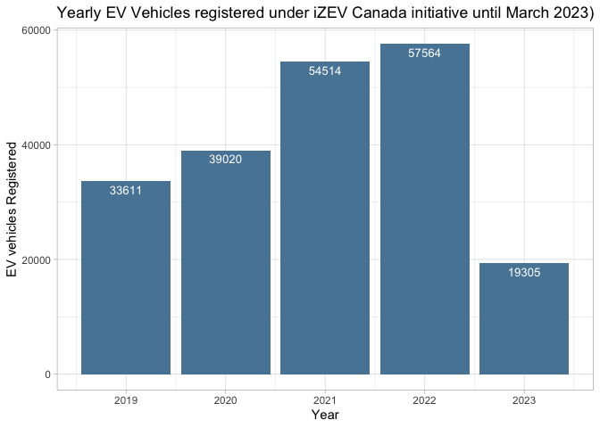
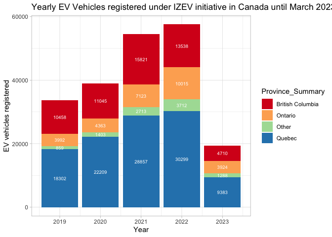
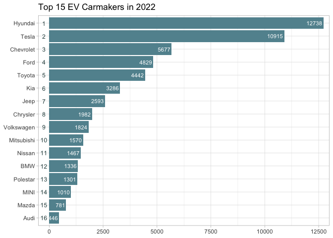
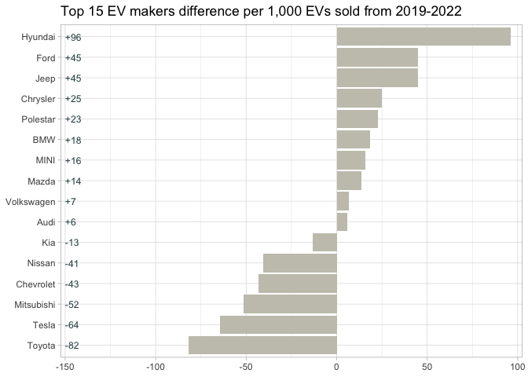
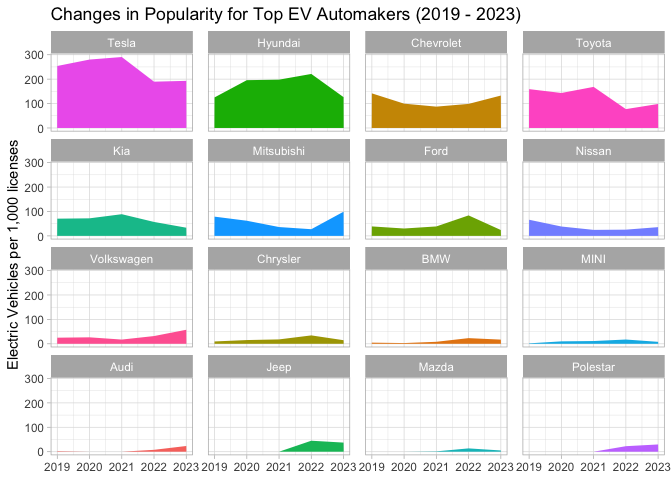
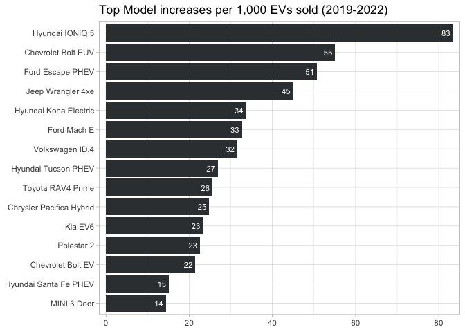
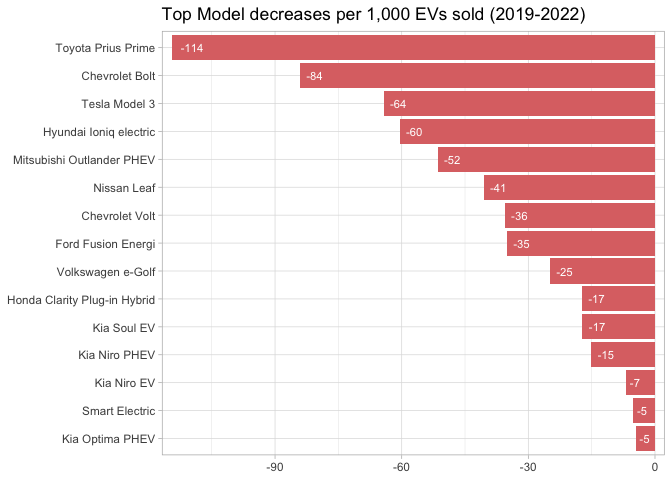

## An Analysis of Zero-Emission Vehicles registered under the iZEV program under Transport Canada. By Stephanie Lo

### Introduction

The following R notebook is companion code to the article: “The starter
guide for transitioning your python projects into R” written by
Stephanie Lo. It contains analysis and accompanying data visuals that
provide an overview on the vehicles registered to have received a
government rebate under the Zero-Emission Vehicles (iZEV) program in
Canada from 2019 - March 2023. The following questions will be answered
over the course of the notebook:

1.  How have the number of vehicles registered under the iZEV program
    changed over the years?
2.  What automobile brands are dominant in terms of absolute sales?
3.  How has automobile brands interest changed over time from the start
    of the program?
4.  The Top 10 electric model increases and Top 10 decreases?

### Installation and loading in packages

To begin we can install and load in the packages we need:

``` r
#only install these the first time
#install.packages('tidyverse')
#install.packages('sqldf')
```

Above installation code only needs to run once to ensure that you have
the correct base packages.

``` r
#loading in the packages 
library(tidyverse)
```

    ## ── Attaching core tidyverse packages ──────────────────────── tidyverse 2.0.0 ──
    ## ✔ dplyr     1.1.0     ✔ readr     2.1.4
    ## ✔ forcats   1.0.0     ✔ stringr   1.5.0
    ## ✔ ggplot2   3.4.1     ✔ tibble    3.1.8
    ## ✔ lubridate 1.9.2     ✔ tidyr     1.3.0
    ## ✔ purrr     1.0.1     
    ## ── Conflicts ────────────────────────────────────────── tidyverse_conflicts() ──
    ## ✖ dplyr::filter() masks stats::filter()
    ## ✖ dplyr::lag()    masks stats::lag()
    ## ℹ Use the ]8;;http://conflicted.r-lib.org/conflicted package]8;; to force all conflicts to become errors

``` r
library(sqldf)
```

    ## Loading required package: gsubfn
    ## Loading required package: proto

    ## Warning in doTryCatch(return(expr), name, parentenv, handler): unable to load shared object '/Library/Frameworks/R.framework/Resources/modules//R_X11.so':
    ##   dlopen(/Library/Frameworks/R.framework/Resources/modules//R_X11.so, 6): Library not loaded: /opt/X11/lib/libSM.6.dylib
    ##   Referenced from: /Library/Frameworks/R.framework/Versions/4.2/Resources/modules/R_X11.so
    ##   Reason: image not found

    ## tcltk DLL is linked to '/opt/X11/lib/libX11.6.dylib'
    ## Could not load tcltk.  Will use slower R code instead.
    ## Loading required package: RSQLite

### Initial Data Exploration

Data exploration consists of looking over the data set once loaded,
looking at data and evaluating what we will keep/remove.

``` r
#read in csv file containing iZEV information
df <- read.csv("/Users/mac/Data/izev-march-2023.csv") #replace this file path with where you saved the csv file

rows <- dim(df)[1]
columns <- dim(df)[2]
print(paste("The dataframe has",rows,"rows and", columns,"columns."))
```

    ## [1] "The dataframe has 204014 rows and 18 columns."

``` r
#view(df) #creates an overview of dataframe in a new window, remove the first '#' to activate
```

``` r
#looking at first 5 rows of the data frame
df %>% head(5)
```

    ##   Incentive.Request.Date Month.and.Year Government.of.Canada.Fiscal.Year..FY.
    ## 1             2019-05-15         May-19                               2019-20
    ## 2             2019-05-16         May-19                               2019-20
    ## 3             2019-05-16         May-19                               2019-20
    ## 4             2019-05-16         May-19                               2019-20
    ## 5             2019-05-16         May-19                               2019-20
    ##   Calendar.Year Dealership.Province...Territory Dealership.Postal.Code
    ## 1          2019                British Columbia                V5C 0J4
    ## 2          2019                          Quebec                G3M 1W1
    ## 3          2019                          Quebec                G3M 1W1
    ## 4          2019                          Quebec                G3M 1W1
    ## 5          2019                          Quebec                J9P 7B2
    ##   Purchase.or.Lease Vehicle.Year Vehicle.Make  Vehicle.Model
    ## 1          Purchase         2019   Volkswagen         e-Golf
    ## 2          Purchase         2019       Nissan           Leaf
    ## 3          Purchase         2019       Nissan           Leaf
    ## 4          Purchase         2019       Nissan           Leaf
    ## 5          Purchase         2019      Hyundai Ioniq electric
    ##   Vehicle.Make.and.Model
    ## 1      Volkswagen e-Golf
    ## 2            Nissan Leaf
    ## 3            Nissan Leaf
    ## 4            Nissan Leaf
    ## 5 Hyundai Ioniq electric
    ##   Battery.Electric.Vehicle..BEV...Plug.in.Hybrid.Electric.Vehicle..PHEV..or.Fuel.Cell.Electric.Vehicle..FCEV.
    ## 1                                                                                                         BEV
    ## 2                                                                                                         BEV
    ## 3                                                                                                         BEV
    ## 4                                                                                                         BEV
    ## 5                                                                                                         BEV
    ##   BEV.PHEV.FCEV...Battery.equal.to.or.greater.than.15.kWh.or..Electric.range.equal.to.or.greater.than.50.km
    ## 1                                                                                                       YES
    ## 2                                                                                                       YES
    ## 3                                                                                                       YES
    ## 4                                                                                                       YES
    ## 5                                                                                                       YES
    ##   BEV..PHEV....15.kWh.or.PHEV...15.kWh..until.April.24..2022...and.PHEV....50.km.or.PHEV...50.km.and..FCEVs...50.km.or.FCEVs...50.km..April.25..2022.onward.
    ## 1                                                                                                                                                        BEV
    ## 2                                                                                                                                                        BEV
    ## 3                                                                                                                                                        BEV
    ## 4                                                                                                                                                        BEV
    ## 5                                                                                                                                                        BEV
    ##   Eligible.Incentive.Amount Individual.or.Organization...Recipient.
    ## 1                     5,000                              Individual
    ## 2                     5,000                              Individual
    ## 3                     5,000                              Individual
    ## 4                     5,000                              Individual
    ## 5                     5,000                              Individual
    ##   Recipient.Province...Territory Country
    ## 1               British Columbia Canada 
    ## 2                         Quebec Canada 
    ## 3                         Quebec Canada 
    ## 4                         Quebec Canada 
    ## 5                         Quebec Canada

With 18 columns, this dataframe contains irrelevant information that we
can remove. Let’s condense the dataframe columns by using the `colnames`
operation and look at the index of the column to identify which ones we
want to remove. Columns to remove: Incentive Request date, Government of
Canada Fiscal Year, Dealership province, dealership post code, and
country

``` r
#identifying column names and positions
colnames(df)
```

    ##  [1] "Incentive.Request.Date"                                                                                                                                    
    ##  [2] "Month.and.Year"                                                                                                                                            
    ##  [3] "Government.of.Canada.Fiscal.Year..FY."                                                                                                                     
    ##  [4] "Calendar.Year"                                                                                                                                             
    ##  [5] "Dealership.Province...Territory"                                                                                                                           
    ##  [6] "Dealership.Postal.Code"                                                                                                                                    
    ##  [7] "Purchase.or.Lease"                                                                                                                                         
    ##  [8] "Vehicle.Year"                                                                                                                                              
    ##  [9] "Vehicle.Make"                                                                                                                                              
    ## [10] "Vehicle.Model"                                                                                                                                             
    ## [11] "Vehicle.Make.and.Model"                                                                                                                                    
    ## [12] "Battery.Electric.Vehicle..BEV...Plug.in.Hybrid.Electric.Vehicle..PHEV..or.Fuel.Cell.Electric.Vehicle..FCEV."                                               
    ## [13] "BEV.PHEV.FCEV...Battery.equal.to.or.greater.than.15.kWh.or..Electric.range.equal.to.or.greater.than.50.km"                                                 
    ## [14] "BEV..PHEV....15.kWh.or.PHEV...15.kWh..until.April.24..2022...and.PHEV....50.km.or.PHEV...50.km.and..FCEVs...50.km.or.FCEVs...50.km..April.25..2022.onward."
    ## [15] "Eligible.Incentive.Amount"                                                                                                                                 
    ## [16] "Individual.or.Organization...Recipient."                                                                                                                   
    ## [17] "Recipient.Province...Territory"                                                                                                                            
    ## [18] "Country"

#### Removing irrelevant columns

``` r
#removing columns
clean_df <- df[,-c(1,3,5,6,13,14,16,18)]

#shortening particular column names
clean_df <- clean_df %>% rename(EV.Type= 8, Province.Recipient = 10)

#adding underscores between column names
colnames(clean_df) <- gsub("[^A-Za-z0-9_]", "_", colnames(clean_df))
colnames(clean_df)
```

    ##  [1] "Month_and_Year"            "Calendar_Year"            
    ##  [3] "Purchase_or_Lease"         "Vehicle_Year"             
    ##  [5] "Vehicle_Make"              "Vehicle_Model"            
    ##  [7] "Vehicle_Make_and_Model"    "EV_Type"                  
    ##  [9] "Eligible_Incentive_Amount" "Province_Recipient"

The output of the previous blocks of code has shortened our column
length from 18 down to 10, and after having renamed some lengthy column
titles we are ready to move onto the next step of data
cleaning,involving accounting for nulls and duplicates.

#### Removing nulls and duplicates

``` r
#remove nulls
clean_df <- na.omit(clean_df)
#print output
rows_clean <- dim(clean_df)[1]
columns_clean <- dim(clean_df)[2]
print(paste("The clean dataframe has",rows_clean,"rows and", columns_clean,"columns."))
```

    ## [1] "The clean dataframe has 204014 rows and 10 columns."

We have now removed the sole null value lingering in the dataset. As for
the duplicate values for this project we will leave the data set as is
since each row does not contain a unique identifier and has repeating
information i.e. model, dealership, postal code, so we will have to
trust that the inputs are correct.

Last thing to do is to is for the final question when it comes to
models, where we want to make sure that the model naming is consistent
i.e. ‘Hyundai Ioniq PHEV’ is the same as ‘Hyundai Ioniq Plug-In hybrid’.
We can do so by creating a list and then referring to that list with the
`str_replace_all` function.

``` r
replacements = c(
  "\\bsmart (EQ )fortwo (cabriolet|coupe)" = "Smart Electric",
  "\\bsmart fortwo electric drive (cabriolet|coupe)" = "Smart Electric",
  "\\bVolvo C40?( Recharge)\\b|Volvo XC40" = "Volvo C40",
  "\\bVolvo V60?( Recharge)" = "Volvo V60",
  "\\bNissan Leaf?( Plus)" = "Nissan Leaf",
  "\\bMINI Countryman?( All4)\\b" = "MINI Countryman",
  "\\bMINI (3 Door|Cooper SE 3 Door)?( Hatch)|MINI Cooper SE 3 Door" = "MINI 3 Door",
  "Hyundai Ioniq PHEV|Hyundai Ioniq Plug-In hybrid" = "Hyundai Ioniq PHEV",
  "\\bHyundai Ioniq electric?( Plus)\\b" = "Hyundai Ioniq electric",
  "\\bChevrolet Bolt\\b" = "Chevrolet Bolt",
  "\\bAudi Q4 50 e-tron Quattro|Audi Q4 e-tron Quattro\\b" = "Audi Q4 e-tron Quattro"
)

#replace all strings
clean_df$Vehicle_Make_and_Model <- str_replace_all(clean_df$Vehicle_Make_and_Model,replacements)
```

The data is now cleaned so we can move onto creating our data
visualizations!

### Data Visualizations

Let’s start answering our first question out of the four that we stated
at the beginning.

#### 1.How have the number of vehicles registered under the iZEV program changed over the years?

In this notebook, we can now use the dplyr package (part of tidyverse)
to edit the clean_df dataframe so it’s in a suitable format for
presenting the visuals. Each row of the data set counts as an entry for
a vehicle being entered, so `summarise(total=n())` is needed to count
the rows.

``` r
#grabbing years and associated license totals
df_total_incentives <- clean_df %>%
  group_by(Calendar_Year) %>%
  summarise(total=n()) 

df_total_incentives %>% head(5)
```

    ## # A tibble: 5 × 2
    ##   Calendar_Year total
    ##           <int> <int>
    ## 1          2019 33611
    ## 2          2020 39020
    ## 3          2021 54514
    ## 4          2022 57564
    ## 5          2023 19305

When it comes to plotting data, there are some differences between R’s
ggplot and Python’s plotting libraries. In ggplot, a layering syntax is
used, where different components are added using the “+” operator. Let’s
do this for overall:

``` r
#setting theme for all charts
theme_set(theme_light())

# Converting to a regular data frame
df_total_incentives <- as.data.frame(df_total_incentives)

df_total_incentives %>% 
    ggplot(aes(x = Calendar_Year, y = total)) +     
    geom_bar(stat = "identity", fill = "#5886a5") +   #creating bar chart
    geom_text(aes(label = total), size = 3.5, vjust = 1.5, colour = "white") +  #total count labels
    labs(x = "Year", y = "EV vehicles Registered") +    #x and y axis labels 
    ggtitle("Yearly EV Vehicles registered under iZEV Canada initiative until March 2023)") #title
```

<!-- -->

Plus a slightly more difficult version which includes province
breakdown, which we will do with an SQL statement this time, and then
plot it out.

``` r
#writing the SQL query
query_total_incentives_province <- 'WITH total_incentives AS (
                                      SELECT   Calendar_Year, 
                                               Province_Recipient,
                                               COUNT(*) AS total
                                      FROM     clean_df
                                      GROUP BY Calendar_Year, Province_Recipient)
                                    SELECT     * 
                                    FROM       total_incentives'

              
#calling the query with sqldf
df_total_incentives_province <- sqldf(query_total_incentives_province)
```

Below, a case when statement has been made to separate the top 3
provinces: Quebec, Ontario and British Columbia from the rest for better
visibility.

``` r
df_total_incentives_province %>% 
  #case when statement to separate out top 3 provinces from the rest
  mutate(Province_Summary = case_when(
    Province_Recipient == "Quebec" ~ "Quebec",
    Province_Recipient == "Ontario" ~ "Ontario",
    Province_Recipient == "British Columbia" ~ "British Columbia",
    TRUE ~ "Other" ))  %>% group_by(Calendar_Year, Province_Summary) %>% summarise(total = sum(total),.groups = "drop") %>%
    #start of ggplot build
    ggplot(aes(x = Calendar_Year, y = total, fill= Province_Summary)) + 
    geom_bar(stat = "identity",position="stack") +
    geom_text(aes(label = total), size = 2.5, position = position_stack(vjust = 0.5), colour = "white") + 
    labs(x = "Year", y = "EV vehicles registered") + 
    ggtitle("Yearly EV Vehicles registered under IZEV initiative in Canada until March 2023)") +
    scale_fill_brewer(palette = "Spectral")
```

<!-- -->

##### Observations

- We can see an overall increase in number of zero-emission vehicles
  registered under the iZEV program from 33,611 licenses in 2019 to
  57,564 licenses in 2022, supporting the growing transition to electric
  vehicles in Canada.
  - Broken out by province, we see Quebec accounted for the largest
    share of licenses, surpassing that of BC, Ontario and Other
    provinces combined, likely in part due to higher financial
    motivations as Québec offers an additional rebate of up to \$8,000
    on top of the Federal government scheme (in contrast BC offers only
    up to \$3,000). In addition, a clear mandate to utility company
    Hydro-Quebec, has aided the EV charger infrastructure in the
    province, helping to ease driver concerns of where to recharge.
  - Important to note that while the EV space is growing, this only
    represents a small portion of the overall passenger vehicle
    registrations, with close to 95% that remained motor gasoline in
    2021.

#### 2. What automobile brands are dominant in terms of absolute and relative licenses?

What do we mean by absolute licenses registered and relative licenses?
In this case, absolute represents the difference between the original
number and the new one (subtraction), whereas relative calculates
proportions of changes where each unit can be compared to another on a
similar scale (division).

Right now, all of the data that we have only represents absolute counts,
so we need to calculate the relative ones where we will use “per 1,000
vehicles sold” for our relative scale where we will explain and contrast
the two concepts later.

To start we want to create a table that shows vehicle brand by year and
count.

``` r
# create a query for totals based on the year
query_vehicle_counts <- 'SELECT   Vehicle_Make,
                                  Calendar_Year AS year,
                                  COUNT(*) AS total
                         FROM     clean_df\
                         GROUP BY Vehicle_Make,Calendar_Year'

query_vehicle_counts = sqldf(query_vehicle_counts)  #calling the query
query_vehicle_counts <- query_vehicle_counts %>% arrange(year)  #arranging the rows by year
query_vehicle_counts %>% head(5)  #looking at first 5 rows
```

    ##   Vehicle_Make year total
    ## 1         Audi 2019    67
    ## 2          BMW 2019   157
    ## 3    Chevrolet 2019  4766
    ## 4     Chrysler 2019   323
    ## 5         Ford 2019  1303

Next, we want to have each year split out onto their own row where we
can use the pivot_wider function (fairly similar to the `pivot` function
in python).

``` r
#pivoting dataframe to contain totals by make by year
df_brand <- query_vehicle_counts %>%
  pivot_wider(names_from = year, values_from = total, names_prefix = "Totals_")
```

After, we want to calculate the per 1,000 licenses for each year which
we can do by taking each vehicle count by brand, dividing it by the
total vehicles registered and multiplying this by 1,000.

``` r
years <- 2019:2023 #declaring years

#looking at proportion every 1000 cars - for loop 
for (year in years) {
  column_name <- paste0("per_1K_",year)
  total_column <- paste0("Totals_", year)
  df_brand[[column_name]] <- round(df_brand[[total_column]]/sum(df_brand[[total_column]], na.rm = TRUE),4) *1000
}
df_brand %>% head(5)
```

    ## # A tibble: 5 × 11
    ##   Vehicle_Make Totals_…¹ Total…² Total…³ Total…⁴ Total…⁵ per_1…⁶ per_1…⁷ per_1…⁸
    ##   <chr>            <int>   <int>   <int>   <int>   <int>   <dbl>   <dbl>   <dbl>
    ## 1 Audi                67      NA      NA     446     452     2      NA      NA  
    ## 2 BMW                157     118     447    1336     331     4.7     3       8.2
    ## 3 Chevrolet         4766    3886    4765    5677    2563   142.     99.6    87.4
    ## 4 Chrysler           323     597     981    1982     283     9.6    15.3    18  
    ## 5 Ford              1303    1177    2110    4829     464    38.8    30.2    38.7
    ## # … with 2 more variables: per_1K_2022 <dbl>, per_1K_2023 <dbl>, and
    ## #   abbreviated variable names ¹​Totals_2019, ²​Totals_2020, ³​Totals_2021,
    ## #   ⁴​Totals_2022, ⁵​Totals_2023, ⁶​per_1K_2019, ⁷​per_1K_2020, ⁸​per_1K_2021

Now we want to calculate difference between 2022 and 2019 in terms of
absolute change, and proportional change.

``` r
df_brand[is.na(df_brand)] <- 0 #setting null values to 0
df_brand <- df_brand %>% mutate(prop_num_change = per_1K_2022 - per_1K_2019) 
df_brand <- df_brand %>% mutate(abs_num_change = Totals_2022 - Totals_2019) 

df_brand %>% head(5)
```

    ## # A tibble: 5 × 13
    ##   Vehicle_Make Totals_…¹ Total…² Total…³ Total…⁴ Total…⁵ per_1…⁶ per_1…⁷ per_1…⁸
    ##   <chr>            <int>   <int>   <int>   <int>   <int>   <dbl>   <dbl>   <dbl>
    ## 1 Audi                67       0       0     446     452     2       0       0  
    ## 2 BMW                157     118     447    1336     331     4.7     3       8.2
    ## 3 Chevrolet         4766    3886    4765    5677    2563   142.     99.6    87.4
    ## 4 Chrysler           323     597     981    1982     283     9.6    15.3    18  
    ## 5 Ford              1303    1177    2110    4829     464    38.8    30.2    38.7
    ## # … with 4 more variables: per_1K_2022 <dbl>, per_1K_2023 <dbl>,
    ## #   prop_num_change <dbl>, abs_num_change <int>, and abbreviated variable names
    ## #   ¹​Totals_2019, ²​Totals_2020, ³​Totals_2021, ⁴​Totals_2022, ⁵​Totals_2023,
    ## #   ⁶​per_1K_2019, ⁷​per_1K_2020, ⁸​per_1K_2021

As we can see from the Top 10 lines, abs_num_change shows us the
difference in vehicle count between the period, but we don’t exactly
have a good scale to compare it too. If we take the first line, Audi,
379 may be considered to be a small number, but as compared to what?
This is where prop_num_change helps, how we can read this is that for
every 1,000 EV cars there have been 6 more Audis registered from 2019 -
2022.

From now on we will be using prop_num_change as our value that we
compare.

This next step repivots the years and the per_1K columns that we
calculated into one long pivot table to help prepare these for our
graphs. After, we will join the absolute counts and the per_1K counts
onto one long pivot table.

``` r
# Pivoting for totals
cars_per1K <- df_brand %>%
  pivot_longer(
    cols = c(per_1K_2019:per_1K_2023),
    names_to = "year",
    values_to = "per_1K"
  ) %>%
  select(Vehicle_Make, year, per_1K, prop_num_change)
```

Query vehicle counts has everything we need already so we just need to
join these two:

``` r
cars_per1K$year <- as.numeric(str_replace_all(cars_per1K$year, "^per_1K_", ""))
ev_totals <- query_vehicle_counts %>%
  full_join(cars_per1K, by = c("Vehicle_Make" = "Vehicle_Make", "year" = "year"))
```

Lastly, we want to rank each vehicle by their totals by year, which is
where we can reuse sqldf in order to use window functions to do this
easily:

``` r
ev_totals <- sqldf("SELECT *, 
                    RANK() OVER (PARTITION BY year ORDER BY TOTAL DESC) AS rank_num
                    FROM ev_totals")
ev_totals %>% head(5)
```

    ##   Vehicle_Make year total per_1K prop_num_change rank_num
    ## 1        Tesla 2019  8533  253.9           -64.3        1
    ## 2       Toyota 2019  5346  159.1           -81.9        2
    ## 3    Chevrolet 2019  4766  141.8           -43.2        3
    ## 4      Hyundai 2019  4208  125.2            96.1        4
    ## 5   Mitsubishi 2019  2650   78.8           -51.5        5

Let’s now plot out the Top 16 Carmakers and filter these out to only
show those in 2022:

``` r
# Filter the data to include only the top 16 brands
top_16_2022 <- ev_totals %>% 
  filter(year==2022, rank_num <= 16)

top_16_2022 %>%
  mutate(Vehicle_Make = fct_reorder(Vehicle_Make, total)) %>%
  ggplot(aes(x = total, y = Vehicle_Make)) +
  geom_bar(stat = "identity", fill = "#62929E") +
  geom_text(aes(label = total), size = 3, hjust = 1.1, colour = "white") + 
  geom_text(aes(x=-250, label = rank_num), size = 3.25, color = "darkslategrey", hjust = 'center') +
  scale_x_continuous(expand = c(.02, .01)) +
  labs(x = NULL, y = NULL) + 
  ggtitle("Top 15 EV Carmakers in 2022") 
```

<!-- -->

We can also create a supplementary plot in order to show how these
automakers have changed over time.

``` r
top_16_2022 %>% 
  #dropping columns with null values of prop_num_change
  drop_na(prop_num_change) %>%
  #case statement for adding labels 
  mutate(num_change_label = case_when( prop_num_change > 0 ~ paste0("+", round(prop_num_change, 0)),
                                       prop_num_change < 0 ~ paste0("-",abs(round(prop_num_change,0))),
                                       TRUE ~ as.character(prop_num_change) )) %>%
  #organizing the vehicle make in the correct order
  mutate(Vehicle_Make = as.factor(Vehicle_Make)) %>%
  mutate(Vehicle_Make = fct_reorder(Vehicle_Make, prop_num_change)) %>%
  ggplot(aes(x = prop_num_change, y = Vehicle_Make)) +
  geom_bar(stat = "identity", fill = "#C6C5B9") +
  geom_text(aes(x = -150, label = num_change_label), size = 3.25, color = "darkslategrey", hjust = 'left') +
  scale_x_continuous(expand = c(.01, .01), limits = c(-150, 100)) +
  labs(x = NULL, y = NULL) + 
  ggtitle("Top 15 EV makers difference per 1,000 EVs sold from 2019-2022")
```

<!-- -->

From looking at complete years of data, Hyundai represented the highest
increase in popularity with 96 cars bought per 1,000 EVs sold, by quite
a large margin, almost double that of the second and third spots with
Jeep and Ford. The success from Hyundai in particular is due to having
the right combination of offering and price, where they launched an
electric SUV, as well as having a digital-focused marketing strategy
that saw five year highs in web traffic. We can also see that Tesla and
Toyota has lost popularity but let’s look at these details more closely
by visualizing these out with subplots.

#### 3. How has automobile brands interest changed over time since the start of the program?

For our third question, we can take the ev_totals graph that we made
earlier and plot out how proportions of vehicles have changed over time
with some subplots (in ggplot this is referred to as facet wrap, but
this is similar to ‘subplots’ in the Python matplotlib library).

``` r
#plotting out graph
ev_totals %>% 
  filter(Vehicle_Make %in% top_16_2022$Vehicle_Make) %>%  
  ggplot(aes(year, per_1K)) + 
  geom_area(aes(fill = Vehicle_Make, group = Vehicle_Make), na.rm = TRUE) + 
  theme(legend.position = "none") + 
  facet_wrap(~fct_reorder(Vehicle_Make, rank_num), ) + 
  labs(x = NULL, y = "Electric Vehicles per 1,000 licenses") + 
  theme(panel.spacing.x = unit(4, "mm")) +
  ggtitle("Changes in Popularity for Top EV Automakers (2019 - 2023)") 
```

<!-- -->

##### Observations

Having the subplots laid out above tell a more complete story where we
can see that even though Tesla remains one of the most popular electric
automaker, innovators such as Tesla have been diluted by new players in
the space who are gaining market share (such as Audi, Jeep, Mazda and
Polestar).

#### 4. The Top 15 electric model increases and Top 15 decreases?

Lastly, let’s look at the specific model increases and decreases in
popularity. In order to this we will be mostly repeating a lot of the
same steps that we have completed for the vehicle brand analysis, but
this time adjusting so that we see vehicle make and model, which
includes combining sqldf queries and tidyverse code.

``` r
# Create a column for totals based on the year
query_model_counts <- 'SELECT     Vehicle_Make_and_Model,
                                  Calendar_Year AS year,
                                  COUNT(*) AS total
                       FROM       clean_df
                       GROUP BY   Vehicle_Make_and_Model,Calendar_Year'
query_model_counts = sqldf(query_model_counts)

query_model_counts <- query_model_counts %>% arrange(year)
```

``` r
#pivoting dataframe to contain totals by make by year
df_model <- query_model_counts %>%
  pivot_wider(names_from = year, values_from = total, names_prefix = "Totals_")

years <- 2019:2023 #declaring years

#looking at per every 1000 cars - for loop 
for (year in years) {
  column_name <- paste0("per_1K_",year)
  total_column <- paste0("Totals_", year)
  df_model[[column_name]] <- round(df_model[[total_column]]/sum(df_model[[total_column]], na.rm = TRUE),4) * 1000
}
df_model[is.na(df_model)] <- 0 #setting null values to 0
df_model <- df_model %>% mutate(prop_num_change = per_1K_2022 - per_1K_2019) #calculating change
```

Let’s now find the largest increases and decreases by model

``` r
# Finding the biggest changes in increases and decreases
top_increases <- df_model %>%
   top_n(15, prop_num_change) 
 
top_decreases <- df_model %>%
   top_n(15, desc(prop_num_change)) 
```

Finally let’s plot this out.

``` r
# Plotting the top 15 model increases by proportions
top_increases %>% 
  mutate(Vehicle_Make_and_Model = fct_reorder(Vehicle_Make_and_Model, prop_num_change)) %>%
  ggplot(aes(x = prop_num_change, y = Vehicle_Make_and_Model)) +
  geom_bar(stat = "identity", fill = "#393D3F") +
  geom_text(aes(label = round(prop_num_change, 0)), size = 3, hjust = 1.3, colour = "white") +
 scale_x_continuous(expand = c(.02, .01)) +
  labs(x = NULL, y = NULL) + 
  ggtitle("Top Model increases per 1,000 EVs sold (2019-2022)") 
```

<!-- -->

##### Observations

Based on the graph above we can see that the Hyundai IONIQ 5 saw the
biggest boost in popularity, where for every 1,000 licenses there were
83 more purchased in 2022 versus 2019. In percentage terms, the model
saw an 8.3% increase during this time period. It is important to note
that the majority of the models that saw growth in popularity are SUVs,
as evident from the top five listed above. This goes with the
preferences of the North American market, where consumers have awaited
larger electric vehicle options, shifting away from smaller sedan
formats that were previously dominant, such as the Tesla Model 3.

``` r
# Plotting the top 15 model decreases by proportions
top_decreases %>% 
  mutate(Vehicle_Make_and_Model = fct_reorder(Vehicle_Make_and_Model, desc(prop_num_change))) %>%
  ggplot(aes(x = prop_num_change, y = Vehicle_Make_and_Model)) +
  geom_bar(stat = "identity", fill = "#DD7373") +
  geom_text(aes(label = round(prop_num_change, 0)), size = 3, hjust = -0.4, colour = "white") +
 scale_x_continuous(expand = c(.02, .01)) +
  labs(x = NULL, y = NULL) + 
  ggtitle("Top Model decreases per 1,000 EVs sold (2019-2022)") 
```

<!-- -->

##### Observations

Whilst still in the Top 5 ranks of most popular automakers, the Toyota
Prius Prime has seen the biggest drop in popularity, with 114 fewer
licences (per 1,000) from 2019 to 2022. The drop may be due to supply
issues and raised prices affecting popularity, but also since it is a
plug-in hybrid model iZEV financial incentives are reduced, where you
can only get half of the full available rebate offered.

The Tesla Model 3 saw a decrease in popularity, with a decline of
licenses of 64 per 1,000 licenses, but it is worth noting that Tesla
still remains a dominant automaker in the market when looking at
absolute totals.
